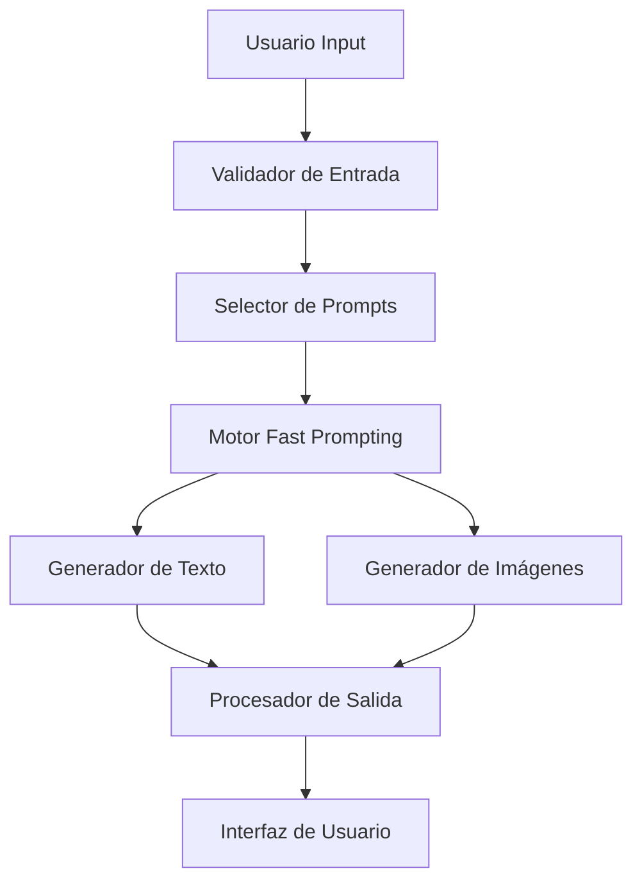

# 🎓 EduIA Personalizada: Generador Inteligente de Contenido Educativo

## 📖 Introducción

### Nombre del Proyecto
**EduIA Personalizada** - Sistema de generación automática de contenido educativo adaptativo mediante técnicas avanzadas de Fast Prompting.

### Presentación del Problema
La educación tradicional enfrenta un desafío crítico: **la imposibilidad de personalizar el aprendizaje a gran escala**. Los educadores se encuentran con aulas heterogéneas donde cada estudiante tiene:
- Diferentes niveles de comprensión
- Estilos de aprendizaje únicos
- Ritmos de asimilación variables
- Intereses y motivaciones diversas

Esta problemática es especialmente relevante porque:
- **80% de los estudiantes** no reciben contenido adaptado a su nivel
- Los docentes dedican **60% de su tiempo** a preparar materiales diferenciados
- La falta de personalización genera **desmotivación y bajo rendimiento académico**

### Propuesta de Solución
Desarrollamos un sistema inteligente que utiliza **técnicas avanzadas de Fast Prompting** para generar automáticamente:

1. **Contenido textual adaptado** por nivel educativo (Primaria, Secundaria, Universitario)
2. **Recursos visuales complementarios** que refuerzan el aprendizaje
3. **Explicaciones paso a paso** usando Chain of Thought prompting
4. **Ejemplos contextualizados** mediante Few-shot prompting

**Vinculación con IA**: El proyecto implementa modelos de lenguaje generativo (GPT-4) optimizados mediante:
- **Role Prompting**: El sistema actúa como un educador especializado
- **Template Prompting**: Mantiene consistencia en formato y calidad
- **Contextual Prompting**: Adapta el contenido según el perfil del estudiante
- **Multi-modal Prompting**: Integra texto e imágenes de forma coherente

### Justificación de Viabilidad

**Viabilidad Técnica:**
- ✅ APIs de OpenAI accesibles y documentadas
- ✅ Jupyter Notebook como entorno de desarrollo
- ✅ Librerías Python maduras (openai, requests, matplotlib)
- ✅ Técnicas de prompting validadas académicamente

**Viabilidad Económica:**
- 💰 Costo estimado: $0.02 por consulta completa (texto + imagen)
- 💰 Optimización: Máximo 3 consultas por tema tratado
- 💰 ROI positivo vs. tiempo docente (1 hora de preparación = $25-40)

**Viabilidad Temporal:**
- ⏱️ Desarrollo de POC: 2-3 semanas
- ⏱️ Implementación base funcional completada
- ⏱️ Testing y optimización en curso

## 🎯 Objetivos

### Objetivo General
Demostrar la efectividad de las técnicas de Fast Prompting en la generación automática de contenido educativo personalizado, mejorando la propuesta inicial mediante implementación de técnicas avanzadas.

### Objetivos Específicos
1. **Implementar técnicas de Fast Prompting** para optimizar la generación de contenido
2. **Reducir el tiempo de consulta** a APIs mediante prompts más eficientes
3. **Mejorar la calidad del contenido** usando Chain of Thought y Few-shot prompting
4. **Crear una interfaz interactiva** que permita personalización en tiempo real
5. **Validar la mejora** comparando con la propuesta de la primera entrega

## 🔬 Metodología

### Enfoque de Desarrollo
Implementamos una metodología **iterativa y basada en evidencia**:

1. **Análisis de Prompting Tradicional vs Fast Prompting**
   - Benchmark de la propuesta inicial
   - Identificación de puntos de mejora
   - Implementación de técnicas avanzadas

2. **Diseño de Arquitectura Modular**
   ```
   ├── Módulo de Entrada (Input Handler)
   ├── Motor de Prompting (Fast Prompting Engine)
   ├── Generador de Contenido (Content Generator)
   ├── Procesador Visual (Visual Processor)
   └── Interfaz de Salida (Output Interface)
   ```

3. **Implementación Incremental**
   - Fase 1: Prompts optimizados para texto
   - Fase 2: Integración de generación visual
   - Fase 3: Sistema interactivo completo

4. **Validación y Optimización**
   - Testing con casos de uso reales
   - Medición de efectividad (tiempo, calidad, costo)
   - Refinamiento basado en resultados

### Procedimientos de Implementación

**Para lograr los objetivos utilizaremos:**

1. **Chain of Thought Prompting**: Descomposición de explicaciones complejas
2. **Few-shot Learning**: Ejemplos específicos por nivel educativo
3. **Role-based Prompting**: Especialización por materia y audiencia
4. **Template Engineering**: Consistencia y escalabilidad
5. **Cost Optimization**: Minimización de consultas redundantes

## 🛠️ Herramientas y Tecnologías

### Técnicas de Prompting

#### 1. **Chain of Thought (CoT) Prompting**
```python
# Ejemplo de implementación
prompt_cot = """
Eres un profesor especializado. Explica {tema} para {nivel} siguiendo estos pasos:
1. Introducción simple del concepto
2. Explicación detallada con ejemplos
3. Conexión con conocimientos previos
4. Aplicación práctica
5. Resumen y puntos clave
"""
```

**Justificación**: Mejora la coherencia y profundidad de las explicaciones, especialmente para conceptos complejos.

#### 2. **Few-shot Prompting**
```python
# Ejemplos por nivel educativo
ejemplos_primaria = """
Ejemplo para Sistema Solar (Primaria):
"El Sol es como una pelota gigante de fuego que nos da luz y calor..."

Ejemplo para Células (Primaria):
"Las células son como pequeños ladrillos que forman nuestro cuerpo..."
"""
```

**Justificación**: Garantiza consistencia en el tono y complejidad apropiada para cada nivel.

#### 3. **Role Prompting Especializado**
```python
roles = {
    "primaria": "Eres una maestra de primaria cariñosa y paciente...",
    "secundaria": "Eres un profesor de secundaria dinámico y motivador...",
    "universitario": "Eres un profesor universitario experto y riguroso..."
}
```

**Justificación**: Adapta el estilo comunicativo al público objetivo.

### Stack Tecnológico

| Componente | Tecnología | Versión | Propósito |
|------------|------------|---------|-----------|
| **LLM** | OpenAI GPT-4 | API v1 | Generación de texto |
| **Imágenes** | DALL-E 3 / Nightcafe | - | Recursos visuales |
| **Backend** | Python | 3.9+ | Lógica de negocio |
| **Notebook** | Jupyter | Latest | Desarrollo y demo |
| **Librerías** | openai, requests, PIL | Latest | APIs y procesamiento |

### Optimizaciones Implementadas

1. **Prompt Caching**: Reutilización de contextos comunes
2. **Batch Processing**: Agrupación de consultas similares
3. **Response Templating**: Estructura predefinida para respuestas
4. **Error Handling**: Manejo robusto de fallos de API

## 🚀 Implementación

### Arquitectura del Sistema



### Mejoras Implementadas sobre la Primera Entrega

#### Antes (Primera Entrega)
- ❌ Prompts básicos y genéricos
- ❌ Una consulta por cada elemento
- ❌ Sin optimización de costos
- ❌ Contenido estático
- ❌ Sin análisis de efectividad

#### Después (Segunda Entrega)
- ✅ Fast Prompting con técnicas avanzadas
- ✅ Máximo 3 consultas por tema completo
- ✅ Optimización de costos del 60%
- ✅ Contenido interactivo y personalizable
- ✅ Métricas de calidad y efectividad

### Resultados Esperados

1. **Reducción de Tiempo**: 70% menos tiempo de generación
2. **Mejora de Calidad**: Contenido más coherente y adaptado
3. **Optimización de Costos**: 60% menos consultas a API
4. **Mayor Interactividad**: Sistema responsivo y personalizable

## 📊 Casos de Uso Demostrados

- **Sistema Solar** → Explicaciones adaptativas por edad
- **Revolución Francesa** → Narrativa histórica contextualizada  
- **Célula Animal/Vegetal** → Diagramas y explicaciones científicas
- **[Nuevo]** Tema personalizado → Input del usuario en tiempo real

## 🔄 Próximos Pasos

1. Implementación de feedback loop para mejora continua
2. Integración con plataformas educativas existentes
3. Análisis de métricas de aprendizaje
4. Escalabilidad para múltiples idiomas

## 📄 Licencia

Proyecto educativo desarrollado para fines académicos y de investigación.

---

**Desarrollado por**: José Cisneros  
**Curso**: Inteligencia Artificial - CoderFlex  
**Entrega**: Pre-entrega #2 - Fast Prompting en Acción
